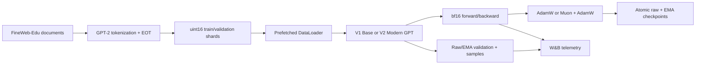

# JarvisLM

**English** · [简体中文](README_zh.md)

> A native-PyTorch reproduction and controlled modernization study of a
> decoder-only language model at the 350M-parameter scale.

[](https://www.python.org/)
[](https://pytorch.org/)


[](https://api.wandb.ai/links/jarviszhang-new-york-university/ngem6azk)
[](https://huggingface.co/JarvisZhang24/JarvisLM-350M)

JarvisLM is an independently implemented language-model training stack built
from core PyTorch modules rather than an off-the-shelf trainer. It contains a
353.5M-parameter V1 baseline and a 315.8M-parameter V2 Modern treatment that
adds grouped-query attention (GQA), QK-Norm, Differential Attention, a
Muon/AdamW optimizer split, and exponential moving average (EMA) weights.

Both models were trained from scratch on the same FineWeb-Edu split for 10,500
optimizer updates on one NVIDIA H200 SXM. Each run processed exactly
5,505,024,000 scheduled tokens with the same 1,024-token context length and
524,288 tokens/update global batch.

## Results at a glance

At the matched stopping point, V2 used **10.7% fewer parameters** and achieved
lower validation loss than V1. Its raw weights improved loss by **0.0306** and
perplexity by **3.0%**; EMA further improved the final result to **2.8925 loss /
18.04 PPL**. The trade-off was an approximately **30.9% reduction in measured
single-H200 throughput**.

| Metric at step 10,500 | V1 Base | V2 Modern Raw | V2 Modern EMA |
| --- | ---: | ---: | ---: |
| Parameters | 353,502,208 | 315,758,848 | 315,758,848 |
| Scheduled tokens | 5,505,024,000 | 5,505,024,000 | 5,505,024,000 |
| Validation loss | 2.9440 | 2.9134 | **2.8925** |
| Validation perplexity | 18.99 | 18.42 | **18.04** |
| Typical throughput | ~164k tokens/s | ~113.4k tokens/s | N/A |
| Optimizer | AdamW | Muon + AdamW | Muon + AdamW |

V2 Modern Raw and V2 Modern EMA are two weight snapshots from the **same
training run**: EMA is a non-trainable moving average (decay 0.9995) of the
raw weights, so it is produced by the same Muon + AdamW optimization rather
than by a different optimizer.

Validation loss and perplexity are the trainer's online measurements on the
project's deterministic held-out split. V1 has no EMA, so the fair
architecture/optimizer comparison is **V1 Base vs V2 Modern Raw**; V2 EMA is
reported separately as the best final weight candidate.
[`scripts/evaluate_checkpoints.py`](scripts/evaluate_checkpoints.py) re-scores
any set of checkpoints at one fixed batch size over the full validation split
for a strictly matched head-to-head measurement.

**Experiment artifacts:**
[public W&B report](https://api.wandb.ai/links/jarviszhang-new-york-university/ngem6azk)
· [Hugging Face model](https://huggingface.co/JarvisZhang24/JarvisLM-350M)
· [`artifacts/training_charts`](artifacts/training_charts)

## The V2 bundle reached a lower loss with fewer parameters

V2 starts from a different parameterization, so the initial losses are not
expected to match exactly. After the early transient, its training curve stays
below V1 and finishes with a lower raw validation loss despite having 37.7M
fewer parameters.


The V2 raw validation curve decreases smoothly to 2.9134. Because W&B logged
V1's primary validation metric as `validation/loss` and V2 raw validation as
`validation/raw_loss`, the exact matched result is given in the table above
rather than presented as a misleading same-key overlay.

<p align="center">
  
  
</p>

The right-hand figure intentionally compares different weight types: V1 raw
and V2 EMA. It shows EMA's slow early catch-up and late advantage, but it is
not used as the fair V1/V2 raw comparison.

## The quality gain came with a throughput cost

V1 sustained approximately 164k tokens/s at about 3.2 seconds/update. V2
sustained approximately 113.4k tokens/s at about 4.6 seconds/update. The V2
cost is consistent with its more expensive Differential Attention path and
additional optimizer/EMA work, but this experiment evaluates the complete
V2 system rather than isolating the cost of each component.

<p align="center">
  
  
</p>

Each run was launched with the micro-batch/accumulation split that best filled
H200 memory at the shared 512-sequence global batch, so these figures are
end-to-end throughput for two tuned single-GPU configurations rather than an
isolated attention-kernel benchmark.

## Training remained numerically stable

Both runs completed without non-finite loss, gradient explosion, or checkpoint
recovery failure. V2's gradient norm is somewhat higher through the middle of
training but decays smoothly and remains bounded.


## What is implemented

### Model

- Decoder-only, pre-normalization Transformer with a tied token embedding and
  language-model head.
- RMSNorm, RoPE, SwiGLU, causal masking, PyTorch scaled dot-product attention,
  and GPT-2-compatible tokenization.
- V1: 16-query/16-KV-head multi-head attention.
- V2: 16-query/4-KV-head GQA, QK-Norm, and Differential Attention.
- Padded 50,304-logit model vocabulary with invalid padded IDs excluded during
  sampling.

### Optimization and training

- bf16 autocast with FP32 model parameters, gradient accumulation, gradient
  clipping, cosine LR decay, and `torch.compile`.
- AdamW for V1; Muon with Newton-Schulz orthogonalization for eligible V2 2D
  attention/MLP matrices and AdamW for embeddings, normalization parameters,
  biases, and scalar parameters.
- EMA shadow weights updated after every V2 optimizer step.
- Raw and EMA validation, deterministic fixed-prompt generation, and W&B
  telemetry for loss, LR, gradient norm, throughput, and step time.

### Reliability

- Atomic checkpoint writes through a temporary file followed by rename.
- Full recovery state: raw model, optional EMA model, AdamW/Muon optimizer
  states, configuration, completed step, and CPU/CUDA RNG state.
- Resume scans checkpoints by recency and can fall back from a truncated newest
  checkpoint to the previous readable checkpoint.
- Fixed-prompt generation forks the RNG so qualitative evaluation does not
  perturb subsequent training randomness.
- RunPod preflight gates verify GPU type, credentials, prepared-data manifest,
  and a completed A100 smoke run before an H200 launch.

## Experimental design

The comparison changes the V2 architecture and optimizer as one treatment
bundle while holding the main data and optimization budget constant.

| Configuration | V1 Base | V2 Modern |
| --- | ---: | ---: |
| Parameters | 353,502,208 | 315,758,848 |
| Layers / hidden size | 24 / 1,024 | 24 / 1,024 |
| Context length | 1,024 | 1,024 |
| Query heads / KV heads | 16 / 16 | 16 / 4 |
| Attention | MHA | GQA + Differential Attention |
| QK-Norm | Off | On |
| Optimizer | AdamW | Muon + AdamW |
| EMA | Off | On, decay 0.9995 |
| Micro-batch / accumulation | 32 / 16 | 64 / 8 |
| Global batch | 524,288 tokens/update | 524,288 tokens/update |
| Updates | 10,500 | 10,500 |
| Token budget | 5,505,024,000 | 5,505,024,000 |
| AdamW peak / minimum LR | 3e-4 / 3e-5 | 3e-4 / 3e-5 |
| Muon peak LR | N/A | 1.5e-4 |
| Warmup / cosine horizon | 1,000 / 20,000 updates | 1,000 / 20,000 updates |
| Random seed | 42 | 42 |
| Hardware | 1× NVIDIA H200 SXM | 1× NVIDIA H200 SXM |

The 20,000-update schedule horizon is intentionally longer than the 10,500
update comparison window. Both runs stop on the same point of the AdamW LR
curve; V2 additionally schedules Muon's LR over the same horizon.

This design supports a **bundle-level descriptive comparison**. It does not
identify the individual causal contribution of GQA, QK-Norm, Differential
Attention, Muon, or EMA. Component-level attribution would require separate
ablation runs.

## Data and metric definitions

JarvisLM uses the GPT-2 tokenizer and the FineWeb-Edu `sample-10BT` stream.
Documents are tokenized with an end-of-text token and written to little-endian
`uint16` binary shards before training.

| Data field | Value |
| --- | ---: |
| Prepared tokenized corpus | 9,953,989,297 tokens |
| Deterministic training pool | 9,933,989,297 tokens |
| Held-out validation split | 20,000,000 tokens |
| Sequence length | 1,024 tokens |
| Storage | Little-endian `uint16` shards |
| Tokens consumed per run | 5,505,024,000 scheduled tokens |

- **Scheduled tokens** are `updates × tokens/update`; they are not a claim that
  the complete FineWeb-Edu `sample-10BT` pool was consumed.
- **Raw weights** are the parameters directly updated by AdamW or
  Muon/AdamW.
- **EMA weights** are a non-trainable exponential moving average of V2's raw
  weights with decay 0.9995.
- **Validation loss/PPL** are next-token cross-entropy and its exponential,
  measured on the same deterministic 20-batch validation protocol.
- **Throughput** is scheduled training tokens divided by optimizer-step time;
  evaluation, sample generation, and checkpoint I/O are outside the steady
  training-step measurement.

## System overview



## Reproducing the project

### Install and test

```bash
conda create -n jarvislm python=3.11 pip -y
conda activate jarvislm
python -m pip install --upgrade pip
python -m pip install -e '.[dev]'

PYTHONPATH=src pytest -q
ruff check .
```

The recorded test suite contains 89 passing tests covering model components,
causal behavior, GQA/Differential Attention, data manifests, Muon parameter
partitioning, EMA selection, checkpoint recovery, and the training smoke path.

### RunPod stages

```bash
# Prepare and verify the shared FineWeb-Edu shards once.
scripts/runpod/run_350m.sh prepare

# V1 baseline.
scripts/runpod/run_350m.sh preflight
scripts/runpod/run_350m.sh full

# V2 Modern.
scripts/runpod/run_v2_modern.sh preflight
scripts/runpod/run_v2_modern.sh full
```

Each launcher pins the micro-batch/accumulation split used for its published
run, so the committed scripts reproduce the reported throughput as-is. See
[`docs/runpod_350m.md`](docs/runpod_350m.md) for the persistent-volume layout,
environment variables, preflight gates, and recovery workflow.

### Matched-protocol evaluation

Online validation is a training-time signal. For a publication-grade
head-to-head number, this script re-scores finished checkpoints at one fixed
batch size over the complete validation split:

```bash
PYTHONPATH=src python scripts/evaluate_checkpoints.py \
  V1=runs/v1-h200-5.5b/checkpoints/last.pt \
  V2=runs/v2-modern-h200-5.5b/checkpoints/last.pt \
  --val-dir data/fineweb-edu-v1-sample-10bt/val --batch-size 32
```

Every checkpoint's raw weights are scored, EMA weights are scored additionally
when present, and the script aborts if any checkpoint ends up seeing a
different number of sequences. It prints a Markdown table.

## Repository layout

```text
.
├── artifacts/training_charts/ # exported W&B evidence
├── docs/runpod_350m.md         # RunPod preparation and training guide
├── scripts/
│   ├── evaluate_checkpoints.py # matched-protocol checkpoint scoring
│   ├── generate_samples.py
│   └── runpod/                 # environment, data, preflight, V1/V2 launchers
├── src/jarvislm/
│   ├── data/                   # streaming preparation, shards, manifests
│   ├── inference/              # checkpoint loading and safe sampling
│   ├── model/                  # GPT, attention, RoPE, RMSNorm, SwiGLU
│   ├── optim/                  # Muon and optimizer partitioning
│   ├── tokenizer/              # GPT-2 tokenizer wrapper
│   └── training/               # trainer, EMA, checkpoints, preflight logic
└── tests/                      # component and integration tests
```

## Limitations and interpretation

- The reported runs process 5.505B scheduled tokens each; neither is described
  as a completed 10B-token training run.
- Final loss/PPL values are the trainer's online validation measurements rather
  than benchmark-grade full-validation estimates;
  `scripts/evaluate_checkpoints.py` re-scores checkpoints over the complete
  held-out split when an exact head-to-head number is needed.
- V2 is a bundled intervention. These experiments do not establish that Muon,
  Differential Attention, or any other individual component caused the full
  observed improvement.
- Throughput is an end-to-end comparison of two tuned single-GPU run
  configurations, not an isolated attention-kernel benchmark.
- Fixed-prompt generations show coherent local English by the end of training,
  but factuality, code generation, and instruction following remain limited in
  the pre-trained base models.

## References and attribution

- John Enev, [*Building a 350M Transformer From Scratch*](https://john463212.substack.com/p/building-a-350m-transformer-from).
- John Enev, [*Modernizing the Architecture*](https://john463212.substack.com/p/modernizing-the-architecture).
- The associated [`modern-llm`](https://github.com/JohnEnev/modern-llm)
  repository, used as the behavioral reference for the V1/V2 reproduction.
- Zhang and Sennrich, *Root Mean Square Layer Normalization*.
- Shazeer, *GLU Variants Improve Transformer*.
- Su et al., *RoFormer*.
- Ainslie et al., *GQA: Training Generalized Multi-Query Transformer Models*.

This repository is an independent educational and engineering reproduction.
Reference-project metrics are not presented as JarvisLM results; only locally
measured checkpoints and runs are reported above.
