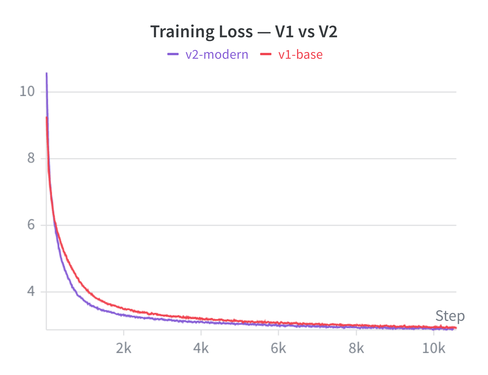
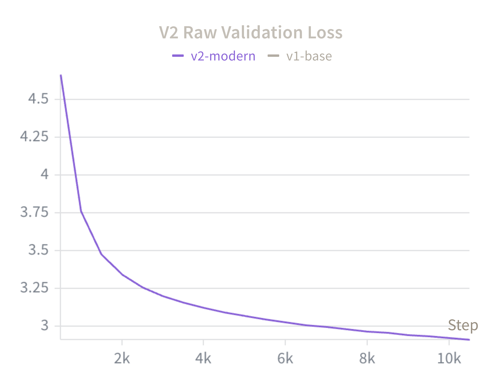
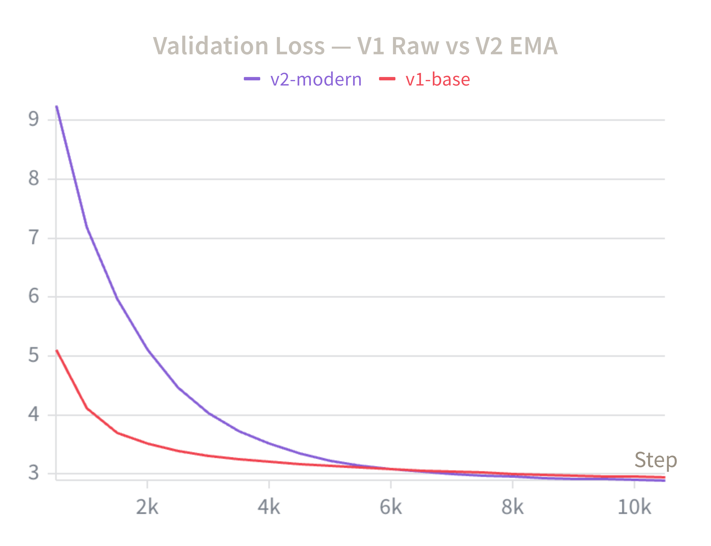
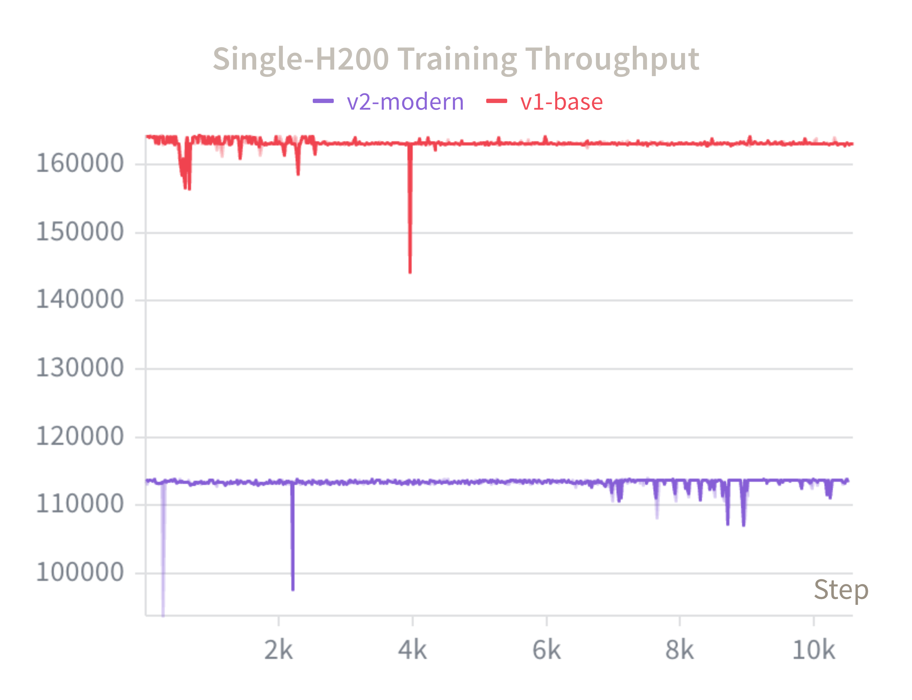
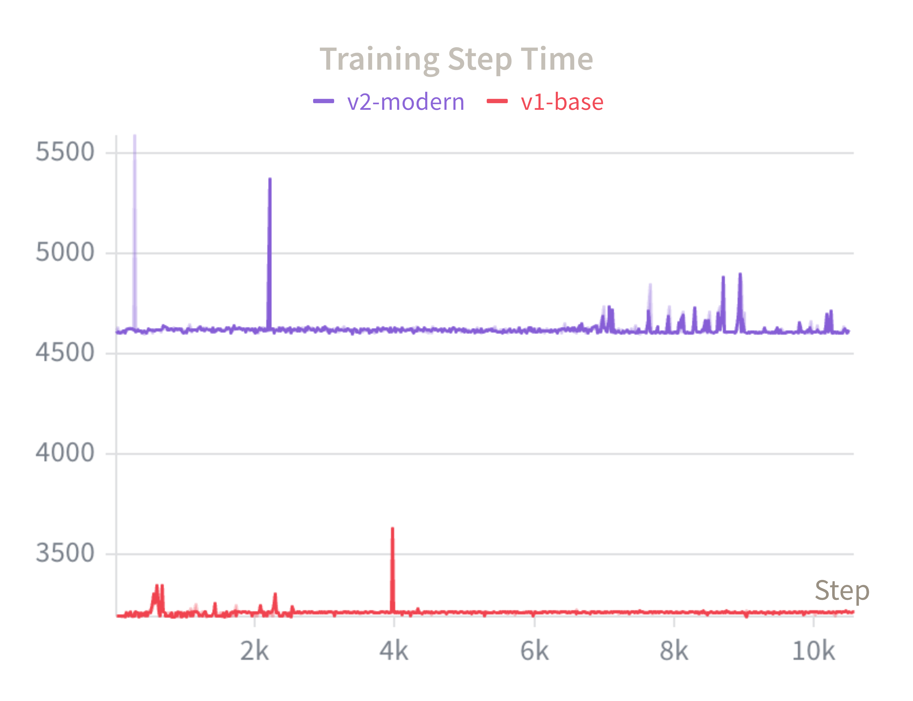
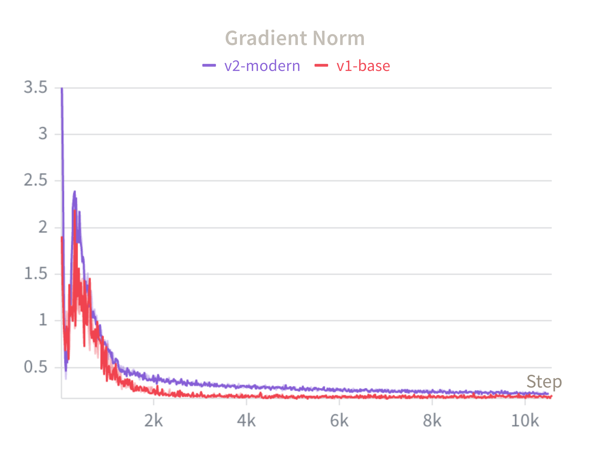
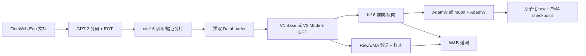

# JarvisLM

**简体中文** · [English](README.md)

> 在 350M 参数规模上，用原生 PyTorch 复现并受控改造一个 decoder-only 语言模型。

[](https://www.python.org/)
[](https://pytorch.org/)


[](https://api.wandb.ai/links/jarviszhang-new-york-university/ngem6azk)
[](https://huggingface.co/CreatorJarvis/JarvisLM-350M)

JarvisLM 是一套完全独立实现的语言模型训练栈，由 PyTorch 基础模块搭建，
没有使用任何现成的 trainer 框架。项目包含一个 353.5M 参数的 V1 基线，
以及一个 315.8M 参数的 V2 Modern 版本——后者引入了分组查询注意力（GQA）、
QK-Norm、Differential Attention、Muon/AdamW 优化器分组，以及指数移动平均
（EMA）权重。

两个模型都在同一份 FineWeb-Edu 数据划分上从零训练 10,500 个优化器更新步，
硬件为单张 NVIDIA H200 SXM。每次训练精确消耗 5,505,024,000 个计划 token，
上下文长度同为 1,024，全局批量同为 524,288 tokens/update。

## 核心结果

V2 用**少 10.7% 的参数**取得了比 V1 更低的验证损失：raw 权重将 loss 降低
**0.0456**、困惑度降低 **4.5%**；EMA 把这一优势扩大到 **0.0661 loss /
6.4% 困惑度**。代价是单卡 H200 实测吞吐**下降约 30.9%**。

| 最终 checkpoint | V1 Base | V2 Modern Raw | V2 Modern EMA |
| --- | ---: | ---: | ---: |
| 参数量 | 353,502,208 | 315,758,848 | 315,758,848 |
| 更新步数 | 10,586 | 10,500 | 10,500 |
| 验证 loss | 2.9595 | 2.9139 | **2.8934** |
| 验证困惑度 | 19.29 | 18.43 | **18.05** |
| 典型吞吐 | ~164k tokens/s | ~113.4k tokens/s | N/A |
| 优化器 | AdamW | Muon + AdamW | Muon + AdamW |

上表所有数字都来自**完整 held-out 验证集**上的一次评估——三份权重使用同一批
19,520 条序列（19,988,480 tokens）、同一个固定 batch size，由
[`scripts/evaluate_checkpoints.py`](scripts/evaluate_checkpoints.py) 产生。
训练器的在线验证（即 W&B 曲线所绘制的内容）只采样 20 个 batch，是训练期信号，
不作为报告结果。

有两处不对称都对 V2 不利，因此实测差距是保守的。其一，V1 保存下来的
checkpoint 停在 10,586 步而非 10,500，多了 86 个更新步、约 4,500 万 token 的
训练量。其二，V1 没有 EMA，因此**架构/优化器的公平对比口径是 V1 Base vs
V2 Modern Raw**；V2 EMA 作为最优最终权重候选单独报告。

V2 Modern Raw 与 V2 Modern EMA 是**同一次训练**的两份权重快照：EMA 是 raw
权重的不可训练滑动平均（decay 0.9995），因此它同样由 Muon + AdamW 优化产生，
而不是换了另一个优化器。

**实验产物：**
[公开 W&B 报告](https://api.wandb.ai/links/jarviszhang-new-york-university/ngem6azk)
· [Hugging Face 模型](https://huggingface.co/CreatorJarvis/JarvisLM-350M)
· [`artifacts/training_charts`](artifacts/training_charts)

## V2 用更少的参数收敛到更低的 loss

V2 的参数化方式与 V1 不同，因此初始 loss 本就不应完全一致。越过早期瞬态之后，
它的训练曲线持续压在 V1 下方，并在参数少 37.7M 的前提下以更低的 raw 验证 loss
收尾。



V2 的 raw 验证曲线在训练全程平滑下降。由于 W&B 中 V1 的主验证指标记录为
`validation/loss`，而 V2 的 raw 验证记录为 `validation/raw_loss`，精确的同基准
结果以上方表格为准，而不是把两个不同键叠成一张容易误读的曲线图。

<p align="center">
  
  
</p>

右图是有意对比两种不同类型的权重：V1 raw 与 V2 EMA。它展示了 EMA 早期缓慢
追赶、后期反超的过程，但**不**作为 V1/V2 raw 的公平对比依据。

## 质量提升伴随着吞吐代价

V1 稳定在约 164k tokens/s、约 3.2 秒/更新步；V2 稳定在约 113.4k tokens/s、
约 4.6 秒/更新步。这一开销与 Differential Attention 更昂贵的计算路径以及额外的
优化器/EMA 工作量相符。需要说明的是，本实验评估的是完整的 V2 系统，而没有
拆分各个组件各自的开销。

<p align="center">
  
  
</p>

两次训练各自采用了在共享的 512 序列全局批量下最能填满 H200 显存的
micro-batch/梯度累积组合，因此这里的数字是两套调优后单卡配置的端到端吞吐，
而非隔离的注意力 kernel 基准测试。

## 训练全程数值稳定

两次训练均未出现非有限 loss、梯度爆炸或 checkpoint 恢复失败。V2 的梯度范数在
训练中段略高于 V1，但平滑衰减且始终有界。



## 实现了什么

### 模型

- Decoder-only 前归一化 Transformer，token embedding 与语言模型头权重共享。
- RMSNorm、RoPE、SwiGLU、因果掩码、PyTorch scaled dot-product attention，
  以及 GPT-2 兼容的分词。
- V1：16 查询头 / 16 KV 头的多头注意力。
- V2：16 查询头 / 4 KV 头的 GQA、QK-Norm 与 Differential Attention。
- 模型词表填充至 50,304 维 logits，采样时排除无效的填充 ID。

### 优化与训练

- bf16 autocast + FP32 模型参数、梯度累积、梯度裁剪、余弦学习率衰减、
  `torch.compile`。
- V1 使用 AdamW；V2 对符合条件的 2D 注意力/MLP 矩阵使用带 Newton-Schulz
  正交化的 Muon，对 embedding、归一化参数、偏置和标量参数使用 AdamW。
- EMA 影子权重在 V2 每个优化器步之后更新。
- Raw 与 EMA 双路验证、确定性固定 prompt 生成，以及覆盖 loss、学习率、
  梯度范数、吞吐和单步耗时的 W&B 遥测。

### 可靠性

- Checkpoint 采用临时文件 + 原子重命名的写入方式。
- 完整的恢复状态：raw 模型、可选的 EMA 模型、AdamW/Muon 优化器状态、配置、
  已完成步数，以及 CPU/CUDA 随机数状态。
- 断点续训按时间新旧扫描 checkpoint，可以从被截断的最新文件回退到上一个
  可读的 checkpoint。
- 固定 prompt 生成会 fork 随机数流，使定性评估不会扰动后续训练的随机性。
- RunPod 预检门禁在启动 H200 之前校验 GPU 型号、凭据、数据清单，以及一次
  已完成的 A100 冒烟运行。

## 实验设计

该对比把 V2 的架构与优化器作为**一个整体处理组**进行变更，同时保持主要的
数据与计算预算不变。

| 配置项 | V1 Base | V2 Modern |
| --- | ---: | ---: |
| 参数量 | 353,502,208 | 315,758,848 |
| 层数 / hidden size | 24 / 1,024 | 24 / 1,024 |
| 上下文长度 | 1,024 | 1,024 |
| 查询头 / KV 头 | 16 / 16 | 16 / 4 |
| 注意力 | MHA | GQA + Differential Attention |
| QK-Norm | 关 | 开 |
| 优化器 | AdamW | Muon + AdamW |
| EMA | 关 | 开，decay 0.9995 |
| Micro-batch / 梯度累积 | 32 / 16 | 64 / 8 |
| 全局批量 | 524,288 tokens/update | 524,288 tokens/update |
| 计划更新步数 | 10,500 | 10,500 |
| 计划 token 预算 | 5,505,024,000 | 5,505,024,000 |
| AdamW 峰值 / 最小学习率 | 3e-4 / 3e-5 | 3e-4 / 3e-5 |
| Muon 峰值学习率 | N/A | 1.5e-4 |
| Warmup / 余弦周期 | 1,000 / 20,000 步 | 1,000 / 20,000 步 |
| 随机种子 | 42 | 42 |
| 硬件 | 1× NVIDIA H200 SXM | 1× NVIDIA H200 SXM |

20,000 步的学习率调度周期刻意长于 10,500 步的对比窗口，使两次训练停在 AdamW
学习率曲线上的同一点；V2 的 Muon 学习率也按同一周期调度。V1 的训练是手动中止
的，保存下来的 checkpoint 落在 10,586 步、超出计划停止点 86 步——这相当于给
基线多了 0.8% 的训练量，报告中的对比未对此做任何修正。

这一设计支持的是**整组层面的描述性对比**，并不能识别 GQA、QK-Norm、
Differential Attention、Muon 或 EMA 各自的因果贡献。组件级归因需要单独的
消融实验。

## 数据与指标定义

JarvisLM 使用 GPT-2 分词器与 FineWeb-Edu `sample-10BT` 数据流。文档在分词时
附加 end-of-text token，并写入小端 `uint16` 二进制分片后再进入训练。

| 数据项 | 数值 |
| --- | ---: |
| 已准备的分词语料 | 9,953,989,297 tokens |
| 确定性训练池 | 9,933,989,297 tokens |
| Held-out 验证划分 | 20,000,000 tokens |
| 序列长度 | 1,024 tokens |
| 存储格式 | 小端 `uint16` 分片 |
| 每次训练消耗 | 5,505,024,000 计划 tokens |

- **计划 token（scheduled tokens）** = `更新步数 × 每步 token 数`；这不等于
  声称完整消耗了 FineWeb-Edu `sample-10BT` 数据池。
- **Raw 权重**指由 AdamW 或 Muon/AdamW 直接更新的参数。
- **EMA 权重**是 V2 raw 权重的不可训练指数移动平均，decay 为 0.9995。
- **验证 loss / PPL** 是下一 token 的交叉熵及其指数，每个报告的 checkpoint 都
  在完整 held-out 验证集上、以同一个固定 batch size 测得。
- **吞吐**为计划训练 token 数除以优化器步耗时；验证、样本生成与 checkpoint
  I/O 不计入稳态训练步的测量。

## 系统总览



## 复现步骤

### 安装与测试

```bash
conda create -n jarvislm python=3.11 pip -y
conda activate jarvislm
python -m pip install --upgrade pip
python -m pip install -e '.[dev]'

PYTHONPATH=src pytest -q
ruff check .
```

已记录的测试套件包含 92 个通过的测试，覆盖模型组件、因果性行为、
GQA/Differential Attention、数据清单、Muon 参数划分、EMA 选择、checkpoint
恢复，以及训练冒烟路径。

### RunPod 阶段

```bash
# 一次性准备并校验共享的 FineWeb-Edu 分片。
scripts/runpod/run_350m.sh prepare

# V1 基线。
scripts/runpod/run_350m.sh preflight
scripts/runpod/run_350m.sh full

# V2 Modern。
scripts/runpod/run_v2_modern.sh preflight
scripts/runpod/run_v2_modern.sh full
```

每个启动脚本都固定了其已发布运行所使用的 micro-batch/梯度累积组合，因此
仓库中提交的脚本可以直接复现所报告的吞吐。持久卷布局、环境变量、预检门禁与
恢复流程见 [`docs/runpod_350m.md`](docs/runpod_350m.md)。

### 同基准评估

在线验证是训练期信号。若需要可发布级别的正面对比数字，用下面这个脚本在固定
batch size 下、以完整验证集重新给已完成的 checkpoint 打分：

```bash
PYTHONPATH=src python scripts/evaluate_checkpoints.py \
  V1=runs/v1-h200-5.5b/checkpoints/last.pt \
  V2=runs/v2-modern-h200-5.5b/checkpoints/last.pt \
  --val-dir data/fineweb-edu-v1-sample-10bt/val --batch-size 32
```

脚本会给每个 checkpoint 的 raw 权重打分，存在 EMA 权重时额外打一次分，并在
任意 checkpoint 实际评估的序列数不一致时直接中止。输出为 Markdown 表格。

## 仓库结构

```text
.
├── artifacts/training_charts/  # 导出的 W&B 证据图
├── docs/runpod_350m.md         # RunPod 数据准备与训练指南
├── scripts/
│   ├── evaluate_checkpoints.py # 同基准 checkpoint 打分
│   ├── generate_samples.py
│   └── runpod/                 # 环境、数据、预检、V1/V2 启动脚本
├── src/jarvislm/
│   ├── data/                   # 流式准备、分片、清单
│   ├── inference/              # checkpoint 加载与安全采样
│   ├── model/                  # GPT、注意力、RoPE、RMSNorm、SwiGLU
│   ├── optim/                  # Muon 与优化器参数划分
│   ├── tokenizer/              # GPT-2 分词器封装
│   └── training/               # 训练器、EMA、checkpoint、预检逻辑
└── tests/                      # 组件与集成测试
```

## 局限与解读

- 报告的两次训练各消耗 5.505B 计划 token；两者都不被描述为完成了 10B token
  的训练。
- 报告的 loss/PPL 基于本项目自己的 2000 万 token held-out 划分，不是
  `lm-eval-harness` 或任何公开基准；不同仓库持有不同的验证集，绝对值之间
  不可直接比较。
- V1 保存的 checkpoint 比 V2 多 86 个更新步，两份最终权重并非严格对齐到同一步，
  且该差异对 V1 有利。
- V2 是一个捆绑式干预。这些实验并不能证明 Muon、Differential Attention 或
  任何单一组件造成了全部的观测改进。
- 吞吐是两套调优后单卡运行配置的端到端对比，而非隔离的注意力 kernel 基准。
- 训练结束时固定 prompt 的生成结果具备局部连贯的英文表达，但预训练基座模型
  在事实性、代码生成与指令遵循方面仍然有限。

## 参考与致谢

- John Enev, [*Building a 350M Transformer From Scratch*](https://john463212.substack.com/p/building-a-350m-transformer-from).
- John Enev, [*Modernizing the Architecture*](https://john463212.substack.com/p/modernizing-the-architecture).
- 相关的 [`modern-llm`](https://github.com/JohnEnev/modern-llm) 仓库，
  作为 V1/V2 复现的行为参照。
- Zhang and Sennrich, *Root Mean Square Layer Normalization*.
- Shazeer, *GLU Variants Improve Transformer*.
- Su et al., *RoFormer*.
- Ainslie et al., *GQA: Training Generalized Multi-Query Transformer Models*.

本仓库是一个独立的教学与工程复现项目。参照项目的指标不作为 JarvisLM 的结果
呈现；以上只报告本地实测的 checkpoint 与训练运行。
